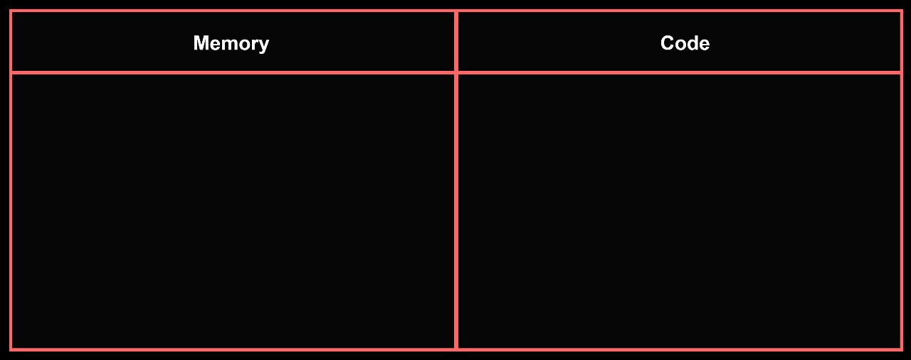
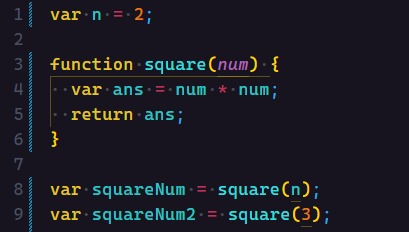
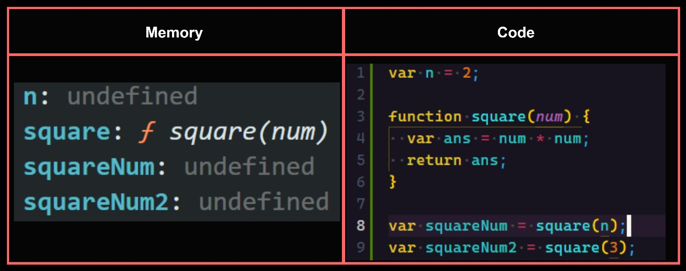
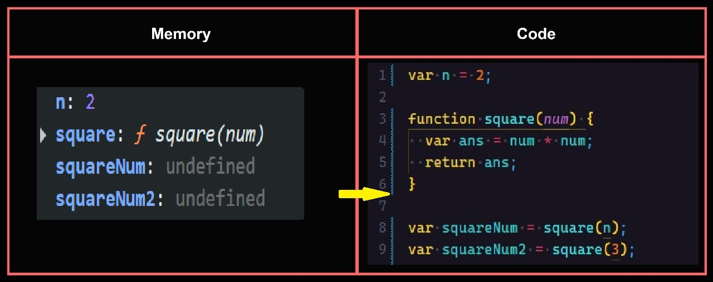
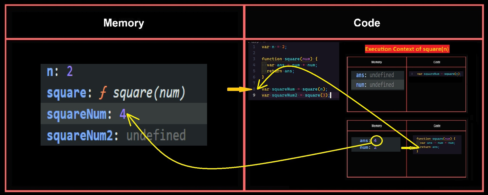
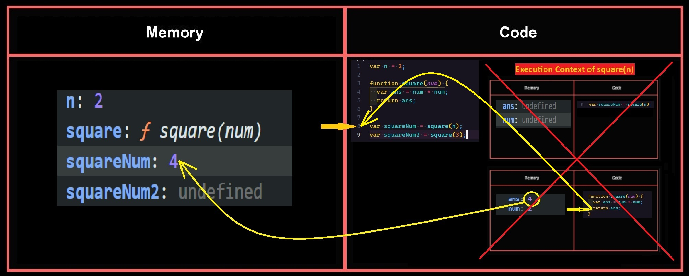
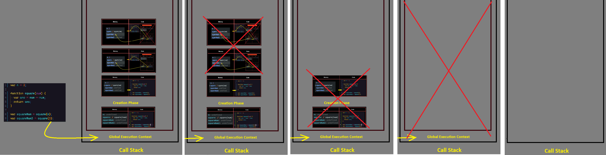
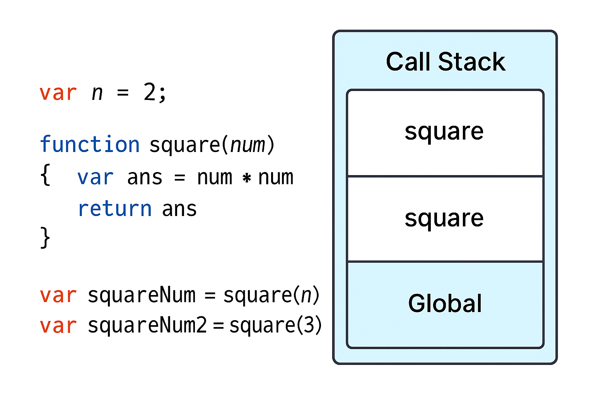

# JavaScript

## 📜 Context:

- In JavaScript, the term **context** generally refers to the value of **`this`** within a particular part of the code. Understanding context is crucial for understanding how methods and functions behave when they are called, especially in relation to object-oriented programming and event handling.

### 🔍 What is Context?

- Context is determined by how a function is called and refers to the object to which a function belongs. It is represented by the keyword **`this`** inside a function. The value of **`this`** can change depending on how the function is invoked.

### 📖 Determining the Context

The value of **`this`** in different scenarios:

1. **🌐 Global Context:**
   - When code is executed in the global context, **`this`** refers to the **global object** (e.g., `window` in browsers, `global` in Node.js).

   ```javascript
   console.log(this); // In browsers, this refers to the window object
   ```

2. **🔧 Function Context:**
   - In a regular function, **`this`** refers to the global object in non-strict mode, and `undefined` in strict mode.

   ```javascript
   function showThis() {
     console.log(this);
   }
   showThis(); // Global object (window in browsers) or undefined in strict mode
   ```

3. **🏠 Method Context:**
   - When a method is called as a property of an object, **`this`** refers to the object the method is called on.

   ```javascript
   const obj = {
     value: 42,
     showThis: function () {
       console.log(this);
     },
   };
   obj.showThis(); // `this` refers to `obj`
   ```

4. **🏗️ Constructor Context:**
   - When a function is used as a constructor (with the **`new`** keyword), **`this`** refers to the newly created instance.

   ```javascript
   function MyObject() {
     this.value = 42;
     console.log(this);
   }
   const instance = new MyObject(); // `this` refers to the new instance
   ```

5. **🔗 Explicit Binding:**
   - Using **`call`**, **`apply`**, or **`bind`**, you can explicitly set the value of **`this`**.

   ```javascript
   function showThis() {
     console.log(this);
   }
   const obj = { value: 42 };
   showThis.call(obj); // `this` refers to `obj`
   ```

6. **➡️ Arrow Functions:**
   - Arrow functions do not have their own **`this`** binding. Instead, **`this`** is lexically inherited from the parent scope at the time the arrow function is defined.

   ```javascript
   const obj = {
     value: 42,
     showThis: () => {
       console.log(this);
     },
   };
   obj.showThis(); // `this` refers to the global object (or undefined in strict mode)
   ```

### 💡 Example to Illustrate Different Contexts

```javascript
// Global context
console.log(this); // `this` refers to the global object (window in browsers)

// Function context
function showThis() {
  console.log(this); // `this` depends on how the function is called
}
showThis(); // `this` refers to the global object (or undefined in strict mode)

// Method context
const obj = {
  value: 42,
  showThis: function () {
    console.log(this); // `this` refers to `obj`
  },
};
obj.showThis(); // `this` refers to `obj`

// Constructor context
function MyObject() {
  this.value = 42;
  console.log(this); // `this` refers to the new instance
}
const instance = new MyObject(); // `this` refers to the new instance

// Explicit binding
function showThis() {
  console.log(this); // `this` depends on how the function is called
}
const anotherObj = { value: 42 };
showThis.call(anotherObj); // `this` refers to `anotherObj`

// Arrow function context
const objWithArrow = {
  value: 42,
  showThis: () => {
    console.log(this); // `this` is inherited from the parent scope
  },
};
objWithArrow.showThis(); // `this` refers to the global object (or undefined in strict mode)
```

### 📝 Summary

- Context is determined by how a function is called and is represented by **`this`** inside the function.
- Different ways of calling a function (global, method, constructor, explicit binding, and arrow functions) result in different values of **`this`**.
- Understanding context is crucial for effective use of **`this`**, especially when dealing with object-oriented programming, event handling, and callbacks in JavaScript.

## ⚙️ Execution Context:

- Everything inside JavaScript happens within the Execution Context.
- The Execution Context contains two components: the Memory Component (Variable Environment) and the Code Component (Thread of Execution).
- The Memory Component holds all variables and functions in key-value pairs. It is also called the variable environment.
- The Code Component is where code is executed one line at a time. It is also called the Thread of Execution.
- JavaScript is a synchronous, single-threaded language:
  - **Synchronous:** One command at a time.
  - **Single Threaded:** Executes code in a specific synchronous order.

### 🔄 How is .js executed and what is the call stack?

When a `.js` program is run, a global execution context is created in two phases:

1. Memory allocation phase
2. Code execution phase



### 📂 Memory Allocation Phase:

1. The very first thing JavaScript does is memory allocation. It goes to line 1 of the code and allocates memory space for variables and functions.
2. For variables, it stores `undefined` as a placeholder value.
3. For functions, it stores the entire function definition in memory.

4. This marks the end of the memory allocation phase.

### 🚀 Code Execution Phase:

1. In this phase, the code is executed line by line. The values of variables are updated, and functions are invoked as per the code logic.
2. As it encounters `var n = 2`, it assigns `2` to `n`. Until now the value of `n` was **`undefined`**.
3. For the `function square`, there is nothing to execute as these lines were already handled during the memory creation phase.

4. Now coming to **line 8**, i.e. `var squareNum = square(n)`, here functions behave a bit differently than in some other languages:
  - A new **execution context** is created altogether.
  - Again, in this new execution context, during the memory creation phase, memory is allocated to `num` and `ans` variables, and `undefined` is placed in them.
  - Now in the code execution phase of this execution context, first `2` is assigned to `num`.
  - The line `var ans = num * num` stores `4` in `ans`.
  - After that, `return ans` returns control of the program back to where the function was invoked.
  - When the `return` keyword is encountered, it returns control to the calling line, and the function's execution context is deleted.
5. Now the control comes to **line 9** similar way it will get executed, after that is finished the **Global Execution Context** is destroyed.

### 🗂️ Call Stack
  - Javascript manages code creation, execution context and deletion with the help of **Call stack**.
  - The **Call stack** is a mechanism used by JavaScript (and many other programming languages) to keep track of function calls. It operates in a Last In, First Out (LIFO) manner — the last function pushed onto the stack is the first one to be popped off when its execution is complete.
  - The **Call stack** keeps track of function invocations.
  - When a function is called, it's pushed onto the stack.
  - When the function finishes executing, it's popped off the stack. 